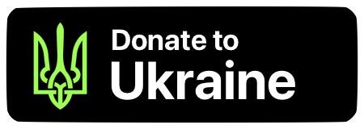

# Subviews

**...or the bright new future of UIKit (maybe)**

<a href="https://u24.gov.ua">
  
</a>

---

**Subviews** is a lightweight package built on top of **UIKit** that provides a new way of writing custom view subclasses with less boilerplate and more clarity.

In short, it transforms all this code:

```swift
final class HelloWorldView: UIView {
    let label = UILabel()
    
    init() {
        super.init(frame: .zero)
        configure()
    }
    
    required init?(coder: NSCoder) {
        fatalError("init(coder:) has not been implemented")
    }
    
    func configure() {
        label.text = "Hello, UIKit 2023"
        label.translatesAutoresizingMaskIntoConstraints = false
        addSubview(label)
        NSLayoutConstraint.activate([
            label.topAnchor.constraint(equalTo: topAnchor),
            label.bottomAnchor.constraint(equalTo: bottomAnchor),
            label.leadingAnchor.constraint(equalTo: leadingAnchor),
            label.trailingAnchor.constraint(equalTo: trailingAnchor),
        ])
    }
}
```

Into this:

```swift
import Subviews

final class HelloWorldView: Superview {
    @Subview(.pin, {
        $0.text = "Hello, UIKit 2023"
    })
    var label = UILabel()
}
```

> **Note**<br>
> Help save Ukraine. [Donate via United24](https://u24.gov.ua), the official fundraising platform by the President of Ukraine

<a href="https://u24.gov.ua">
  
</a>

## Showcase

Simplest view with quick layout options:

```swift
final class EmptyStateView: Superview {

    @Subview([.alignCenterX, .alignCenterY(offset: -10)], {
        $0.text = "This list is empty"
    })
    var label = UILabel()
    
}
```

More advanced example using stack views and dynamic view configuration with `self`:

```swift
final class EmojiLogoView: Superview {
    let republicName: String
    let republicEmoji: String
    
    init(republicName: String, republicEmoji: String) {
        self.republicName = republicName
        self.republicEmoji = republicEmoji
        super.init()
    }
    
    @Subview(.pin, {
        $0.axis = .vertical
        $0.alignment = .center
    })
    var stackView = UIStackView()
    
    @ArrangedSubview(of: \.stackView, { (label, self) in
        label.font = .systemFont(ofSize: 60)
        label.text = self.republicEmoji
    })
    var emojiSeal = UILabel()
    
    @ArrangedSubview(of: \.stackView, { (label, self) in
        label.font = .systemFont(
            ofSize: 20,
            weight: .heavy,
            width: .condensed
        )
        label.text = self.republicName
    })
    var nameLabel = UILabel()
}

let republicOfBoba = EmojiLogoView(republicName: "REPUBLIC OF BOBA", republicEmoji: "🧋")
```


Even more advanced example featuring more quick layout options and dynamic view creation using `self`:

```swift
final class BestFlagView: Superview {
    let republicName: String
    let republicEmoji: String
    
    init(republicName: String, republicEmoji: String) {
        self.republicName = republicName
        self.republicEmoji = republicEmoji
        super.init()
    }
    
    @Subview([.pinTop, .pinHorizontally, .relativeHeight(0.8)], {
        $0.backgroundColor = .white
    })
    var whiteBackground = UIView()
    
    @Subview([.pinBottom, .pinHorizontally, .relativeHeight(0.2)], {
        $0.backgroundColor = .systemRed
    })
    var redStripe = UIView()
    
    @Subview(of: \.whiteBackground, [.alignCenterX, .pinBottom(inset: 4)])
    var logo = { (self) in
        EmojiLogoView(
            republicName: self.republicName,
            republicEmoji: self.republicEmoji
        )
    }
}

let bestFlag = BestFlagView(republicName: "CALIFORNIA BURRITO", republicEmoji: "🌯")
```


Also works with view controllers:

```swift
final class EmptyStateVC: ParentViewController {
    
    // use @Child to add child view controllers:
    @Child([.safeAreaPin], {
        $0.view.backgroundColor = .systemGray
    })
    var backgroundVC = UIViewController()
    
    // @Subview is also supported:
    @Subview(.pin)
    var emptyStateView = EmptyStateView()
    
}
```

## Installation

### Swift Package Manager
1. Click File &rarr; Swift Packages &rarr; Add Package Dependency.
2. Enter `https://github.com/dreymonde/Subviews.git`

## Guide

### `Superview` / `ParentViewController`

First of all, you should always use `Superview` (or your own class that inherits from `Superview`) as a base class of your custom UIView's (and `ParentViewController` for your custom view controllers). This will ensure that all `@Subview` and `@Child` properties are added properly.

> **Note**<br>
> If you don't want to change your base classes, see [Using `@Subview` without subclassing `Superview`](#using-subview-without-subclassing-superview)

```swift
final class CustomView: Superview {
	// ...
}
final class CustomViewController: ParentViewController {
	// ...
}
```

### Adding `@Subview`s

`@Subview`s can be added to views as well as view controllers:

```swift
final class CustomView: Superview {
    @Subview(.pin)
    var button = UIButton(type: .system)
}
```

If you don't explicitly specify a parent view, a subview will be added directly to `self` (or `self.view` for view controllers). Or you can use `@Subview(of:)` to use a different parent, creating a view hierarchy:

```swift
final class CustomView: Superview {
    @Subview(.pin) // added to `self`
    var background = UIView()
    
    // use the "\." keypath syntax!
    @Subview(of: \.background, .marginsPin) // added to `background`
    var button = UIButton(type: .system)
}
```

### Using quick layout options

**Subviews** provides a lot of convenient easy to use layout modifiers. All of them are 100% UIKit and based on Auto Layout:

```swift
func RectangleView(color: UIColor) -> UIView {
    let view = UIView()
    view.backgroundColor = color
    return view
}

final class GreenFlagView: Superview {
    @Subview([
        .marginsPinHorizontally,
        .pinVertically(insets: .all(4)),
        .height(40),
        .aspectRatio(3.0/2.0)
    ])
    var rectangularFlag = RectangleView(color: .green)
}
```


List of all available quick layout options (`ViewLayoutOption` struct):

```swift
// Center:
// `offset` parameter is optional
.alignCenter(offset:)
.alignCenterX(offset:)
.alignCenterY(offset:)
 
// Size:
.size(_ size:)
.height(_ height:)
.width(_ width:)
.aspectRatio(_ widthToHeight:)
.aspectRatioSquare
.relativeSize(_ relativeSize:)
.relativeHeight(_ relativeHeight:)
.relativeWidth(_ relativeWidth:)
 
// Edges Pin:
// `insets` / `inset` parameter is optional
.pin(insets:)
.pin(inset:)
.pinHorizontally(insets:)
.pinVertically(insets:)
.pinBottom(inset:)
.pinTop(inset:)
.pinLeading(inset:)
.pinTrailing(inset:)
 
// Margins Pin:
// `insets` / `inset` parameter is optional
.marginsPin(insets:)
.marginsPin(inset:)
.marginsPinHorizontally(insets:)
.marginsPinVertically(insets:)
.marginsPinBottom(inset:)
.marginsPinTop(inset:)
.marginsPinLeading(inset:)
.marginsPinTrailing(inset:)
 
// Safe Area Pin:
// `insets` / `inset` parameter is optional
.safeAreaPin(insets:)
.safeAreaPin(inset:)
.safeAreaPinHorizontally(insets:)
.safeAreaPinVertically(insets:)
.safeAreaPinBottom(inset:)
.safeAreaPinTop(inset:)
.safeAreaPinLeading(inset:)
.safeAreaPinTrailing(inset:)
 
// Readable Content Guide Pin:
// `insets` / `inset` parameter is optional
.readableContentPin(insets:)
.readableContentPin(inset:)
.readableContentPinHorizontally(insets:)
.readableContentPinVertically(insets:)
.readableContentPinBottom(inset:)
.readableContentPinTop(inset:)
.readableContentPinLeading(inset:)
.readableContentPinTrailing(inset:)
```

You can use one or many layout options with `@Subview` or `@Child`:

```swift
@Subview(.alignCenter)
@Subview([.pinTop, .pinBottom, .marginPinLeading])
@Child(.safeAreaPin)
@Child([.pinVertically, .alignCenterX, .relativeWidth(0.8)])
```

### Using basic configuration block

If you want to perform any configuration on a subview itself, or fine-tune the auto layout code, you can simply use a basic configuration block in `@Subview` or `@Child`

```swift
final class SuccessLabel: Superview {
    @Subview(.pin, {
        $0.text = "Success!"
        $0.font = .systemFont(ofSize: 24, weight: .bold)
        $0.textColor = .systemGreen
    })
    var label = UILabel()
}
```

### Using dynamic configuration block

One of the most amazing things about **Subviews** is that it allows you to use `self` inside the configuration block! Pure Swift generics, no magic.

It's useful for two scenarios. First, it allows you to build complex auto layout constraints where using quick layout options is not enough. For example:

```swift
final class BobaLabel: Superview {
    @Subview([.pinLeading], { (label) in
        label.text = "🧋"
        label.font = .systemFont(ofSize: 48, weight: .heavy)
    })
    var bobaEmoji = UILabel()
    
    // parentheses around (label, self) are required by Swift
    @Subview([.pinTrailing, .pinVertically], { (label, self) in
        label.text = "Boba\nRepublic"
        label.numberOfLines = 0
        label.font = .systemFont(ofSize: 48, weight: .heavy)
        
        NSLayoutConstraint.activate([
            label.leadingAnchor.constraint(equalTo: self.bobaEmoji.trailingAnchor),
            label.firstBaselineAnchor.constraint(equalTo: self.bobaEmoji.firstBaselineAnchor)
        ])
    })
    var textLabel = UILabel()
}
```


And second, it allows you to "inject" the properties of your custom class into subviews easily, without needing any additional functions:

```swift
final class ErrorLabel: Superview {
    let error: Error
    
    init(error: Error) {
        self.error = error
        super.init()
    }
    
    // parentheses around (label, self) are required by Swift
    @Subview(.pin, { (label, self) in
        label.text = self.error.localizedDescription
        label.textAlignment = .center
        label.numberOfLines = 0
    })
    private var errorLabel = UILabel()
}
```

As you see, `errorLabel` can simply grab the `error` property directly from `self`. Again, no magic!

### Using dynamic creation block

Another non-magical feature of **Subview** is creating subviews using dynamic blocks with `self`:

```swift
final class SymbolLabel: Superview {
    let systemSymbolName: String
    
    // parentheses around (self) are required by Swift
    @Subview(.pin)
    var systemImageView = { (self) in
        let image = UIImage(systemName: self.systemSymbolName)
        return UIImageView(image: image)
    }
    
    init(systemSymbolName: String) {
        self.systemSymbolName = systemSymbolName
        super.init()
    }
}

// 􁜫
let volleyball = SymbolLabel(systemSymbolName: "volleyball.fill")
```

### Using stack views

Of course, no modern UIKit code exists without stack views. **Subviews** provides support for stack views using `@ArrangedSubview(of:)` property wrapper:

```swift
final class UkraineFlag: Superview {
    // UIStackView should be defined first
    @Subview(.pin, {
        $0.axis = .vertical
        $0.distribution = .fillEqually
    })
    var stack = UIStackView()
    
    // Make sure you use @ArrangedSubview, not @Subview!
    @ArrangedSubview(of: \.stack, {
        $0.backgroundColor = .systemBlue
    })
    var topStripe = UIView()
    
    @ArrangedSubview(of: \.stack, {
        $0.backgroundColor = .systemYellow
    })
    var bottomStripe = UIView()
}
```


> **Warning**<br>
> Make sure you're using `@ArrangedSubview` with stack views, not `@Subview`!

`@ArrangedSubview` supports quick layout options, configuration blocks and dynamic creation blocks, same as `@Subview`:

```swift
final class FlaggedLogo: Superview {
    let title: String
    
    init(title: String) {
        self.title = title
        super.init()
    }
    
    @Subview(.pin, {
        $0.axis = .horizontal
        $0.alignment = .center
        $0.spacing = 12
    })
    var mainStack = UIStackView()
    
    @ArrangedSubview(of: \.mainStack, [.height(40), .aspectRatioSquare])
    var flag = UkraineFlag()
    
    @ArrangedSubview(of: \.mainStack, { (label, self) in
        label.text = self.title
        label.font = .systemFont(ofSize: 36, weight: .heavy, width: .condensed)
    })
    var text = UILabel()
}

let bravery = FlaggedLogo(title: "BRAVERY")
```


### _[Experimental]_ Using `HorizontalStack` / `VerticalStack`

> **Warning**<br>
> This feature is experimental and might be changed or removed in future versions (with notice). If you want to help **Subviews**, please try it out and I'm excited to see your feedback!

If you don't want to use `@ArrangedSubview`, you can opt in for experimental `_HorizontalStack` / `_VerticalStack` functions that takes a `self`-specified result builder:

```swift
func RectangleView(color: UIColor) -> UIView {
    let view = UIView()
    view.backgroundColor = color
    return view
}

final class PeruFlag: Superview {
    let leftStripe = RectangleView(color: .red)
    let centerStripe = RectangleView(color: .white)
    let rightStripe = RectangleView(color: .red)
    
    // parentheses around (self) are required by Swift
    @Subview(.pin, {
        $0.distribution = .fillEqually
    })
    var flagStack = _HorizontalStack { (self) in
        self.leftStripe
        self.centerStripe
        self.rightStripe
    }
}
```

It's not required to use `@Subview` for views that will be included in your stacks, but if you want to use any of the `@Subview`-provided features like dynamic creation blocks, you're free to do so:

```swift
final class TwoColorVerticalFlag: Superview {
    let topColor: UIColor
    let bottomColor: UIColor
    
    @Subview
    var topStripe = { RectangleView(color: $0.topColor) }
    // ^ you can use `$0` instead of `(self)` for shorter code
    
    @Subview
    var bottomStripe = { RectangleView(color: $0.bottomColor) }
    
    @Subview(.pin, {
        $0.distribution = .fillEqually
    })
    var flagStack = _VerticalStack { (self) in
        self.topStripe
        self.bottomStripe
    }
    
    init(topColor: UIColor, bottomColor: UIColor) {
        self.topColor = topColor
        self.bottomColor = bottomColor
        super.init()
    }
}

let ukraineFlag = TwoColorVerticalFlag(topColor: .systemBlue, bottomColor: .systemYellow)
let polandFlag = TwoColorVerticalFlag(topColor: .white, bottomColor: .red)
```

Or you can get suspiciously close to SwiftUI by defining your subviews inside the stack block itself:

```swift
final class TwoColorVerticalFlag: Superview {
    let topColor: UIColor
    let bottomColor: UIColor
    
    @Subview(.pin, {
        $0.distribution = .fillEqually
    })
    var flagStack = _VerticalStack { (self) in
        RectangleView(color: self.topColor)
        RectangleView(color: self.bottomColor)
    }
    
    init(topColor: UIColor, bottomColor: UIColor) {
        self.topColor = topColor
        self.bottomColor = bottomColor
        super.init()
    }
}
```

Possibilities are endless. Experiments are encouraged.

### Using `@Subview` without subclassing `Superview`

If for any reason you don't want to adopt a new base class for all your custom views (`Superview`), you can use `@Subview` with your custom `UIView` subclasses as well. For that, you have two options:

- Semi-automatic:
	1. Add conformance to `AddsSubview` protocol
	2. In your initializer, call `resolveAllEnclosedProperties()` function after `super.init`:

```swift
final class HelloWorld: UIView, AddsSubviews {
    @Subview(.pin, {
        $0.text = "Hello, world"
    })
    var label = UILabel()
    
    override init(frame: CGRect) {
        super.init(frame: frame)
        // this is the important part:
        self.resolveAllEnclosedProperties()
    }
    
    @available(*, unavailable)
    required init?(coder: NSCoder) {
        fatalError("init(coder:) has not been implemented")
    }
}
```

- Fully manual:
	1. Add conformance to `AddsSubview` protocol
	2. Call `Subviews` function and list **all** `@Subview` properties:

```swift
final class HelloWorld: UIView, AddsSubviews {
    @Subview(.pin, {
        $0.backgroundColor = .black
    })
    var background = UIView()
    
    @Subview(of: \.background, .alignCenter, {
        $0.text = "Hello, world"
        $0.textColor = .white
    })
    var label = UILabel()
    
    override init(frame: CGRect) {
        super.init(frame: frame)
        // this is the important part:
        Subviews {
            $background // make sure you're using the `$` prefix
            $label
        }
    }
    
    @available(*, unavailable)
    required init?(coder: NSCoder) {
        fatalError("init(coder:) has not been implemented")
    }
}
```

### Using `@Child` & `@Subview` without subclassing `ParentViewController`

The approach to using your own `UIViewController` subclass is the same:

1. Conform to `AddsChildrenViewControllers` and/or `AddsSubviews`
2. In `viewDidLoad()`, after `super.viewDidLoad()` and before any of your custom code, call 	`resolveAllEnclosedProperties()` (semi-automatic mode) or `Children` / `Subviews` (manual mode):

```swift
// Semi-automatic mode
final class EmptyStateVC: UIViewController, AddsChildrenViewControllers, AddsSubviews {
    
    @Child(.safeAreaPin, {
        $0.view.backgroundColor = .systemGray
    })
    var backgroundVC = UIViewController()
    
    @Subview(.pin)
    var emptyStateView = EmptyStateView()
    
    override func viewDidLoad() {
        super.viewDidLoad()
        // important part:
        resolveAllEnclosedProperties()
        
        // your code here
    }
}
```

```swift
// Manual mode
final class EmptyStateVC: UIViewController, AddsChildrenViewControllers, AddsSubviews {
    
    @Child(.safeAreaPin, {
        $0.view.backgroundColor = .systemGray
    })
    var backgroundVC = UIViewController()
    
    @Subview(.pin)
    var emptyStateView = EmptyStateView()
    
    override func viewDidLoad() {
        super.viewDidLoad()
        // important part:
        Children {
            $backgroundVC // don't forget the "$"!
        }
        Subviews {
            $emptyStateView
        }
        
        // your code here
    }
}
```

## Documented features:

- [x] `Superview` / `ParentViewController` base classes
- [x] `@Subview` / `@Child`
- [x] `@Subview` / `@Child` with custom parent (`of:`)
- [x] `@Subview` / `@Child`: quick layout options (`.pin` etc)
- [x] `@Subview` / `@Child`: basic configuration block
- [x] `@Subview` / `@Child`: dynamic configuration block with `self`
- [x] `@Subview` / `@Child`: dynamic creation block with `self`
- [x] Using `@ArrangedSubview` with `UIStackView`
- [x] _Experimental_: `_VerticalStack` / `_HorizontalStack`
- [x] Using `@Subview` / `@Child` without `Superview` / `ParentViewController`
- [ ] `@Subview` / `@Child`: replacement behavior (`onReplace:`)
- [ ] Writing custom `Enclosed` types
- [ ] Writing custom `ViewLayoutOption` (quick layout options)

## FAQ

### Q: ...Why?

A: I love UIKit and still enjoy using it daily. In its pure form, UIKit can be quite clunky to use and usually requires a ton of boilerplate. **Subviews** was first an experiment to see how far I can take Swift type system to make UIKit *more fun to use*. After using **Subviews** for almost a year in my side projects, I now can't imagine my life without it.

### Q: This thing is ridiculous / overengineered / inefficient etc

A: Maybe. I'm not forcing you to use it. Maybe someone will enjoy using **Subviews** as much as I do. Others might find some of the techniques used in its code interesting & valuable for their own work. [Any code deserves to be shared](https://iosdevweekly.com/issues/491?m=web&sid=wzH0Os#t-563547).

### Q: This thing is amazing and I love using it

A: Thanks! Please feel free to share your experience or any feedback with me. Get in touch if you have any thoughts about the future direction of the project too (contact info here: [@dreymonde](https://github.com/dreymonde))

### How on earth does this even work??

A: Mostly using two cool Swift features:

1. [Property wrappers with enclosing instance access](https://www.swiftbysundell.com/articles/accessing-a-swift-property-wrappers-enclosing-instance/)
2. Reflection

I'm thinking about writing a series of articles explaining the inner workings of **Subviews**. Stay tuned.

### Q: Reflection? How about performance?

A: Yes, obviously anything that uses reflection will have worse performance than something that doesn't. But in the vast, vast vast majority of use cases for custom view subclasses, the performance hit will be unnoticeable. You might be surprised to learn that SwiftUI uses reflection _a lot_ (albeit a more advanced one), and it doesn't seem to be bothering anyone.

If you're worried about potential performance issues, you can use **Subviews** in manual mode, see [Using `@Subview` without subclassing `Superview`](#using-subview-without-subclassing-superview).

### Q: Is this production-ready?

A: I have side projects in production running this code for more than a year. So from my point of view, yes, it's production-ready.

Technically, it's using some "underscore prefix" Swift APIs which can change at some point in the future - but it's also the same APIs that are used by Apple's own code. They're not going to disappear.

That said, **Subviews** itself is not in "1.0" state yet. Breaking changes might happen with updates. It also provides some public APIs with underscore prefix - those are experimental and might change or get removed.

All reflection-related code is stable and official. No funny business.

### Q: Can I mix Subviews and UIKit code?

A: **Subviews** _is_ 100% UIKit & Auto Layout. You can put your own UIKit code anywhere.

### Q: 

### Q: Does this work with AppKit?

A: Not yet. Let me know if that's something you are interested in.

### Q: How can I help?

A: [Donate to Ukraine](https://u24.gov.ua). Thank you
